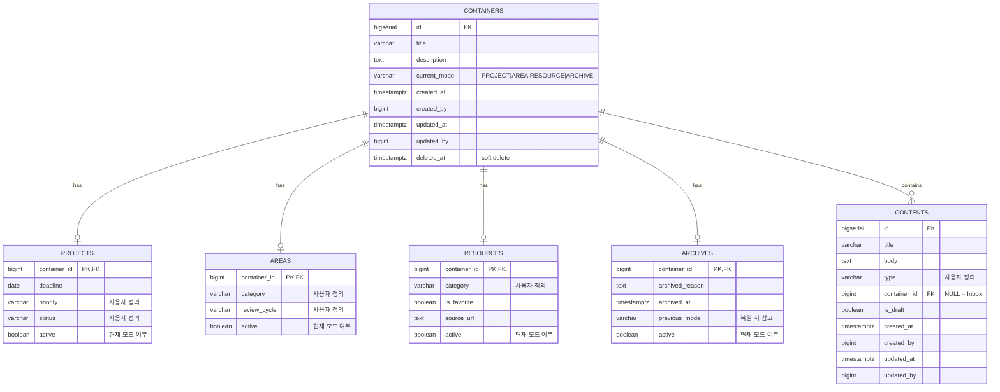
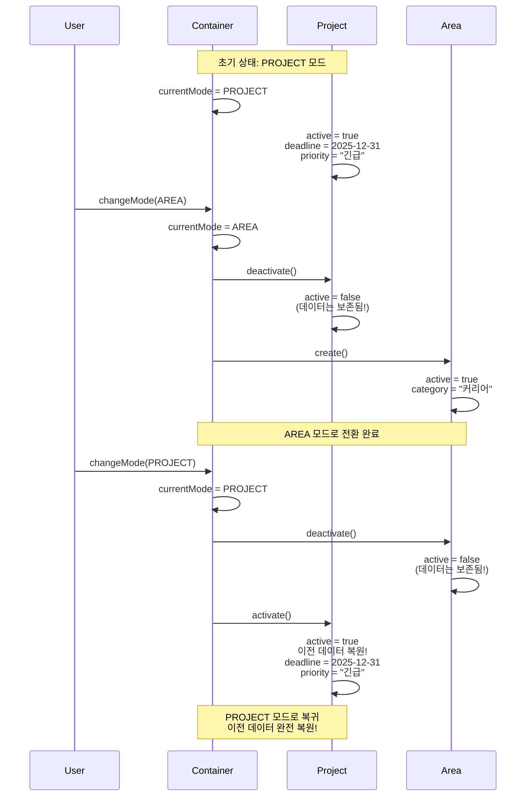
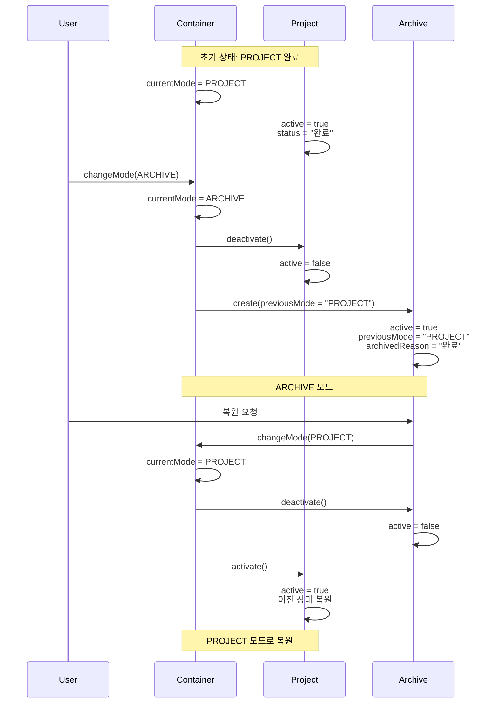
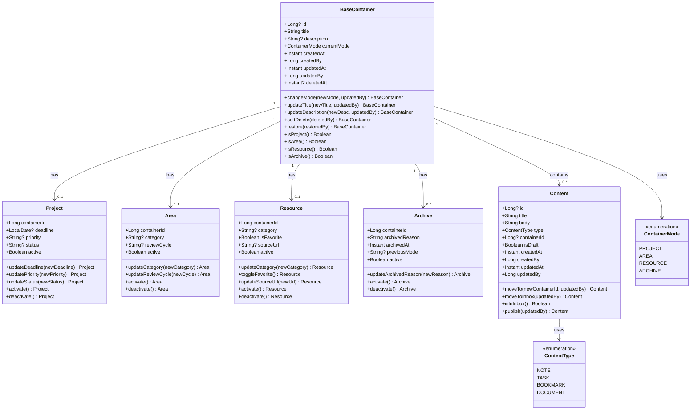
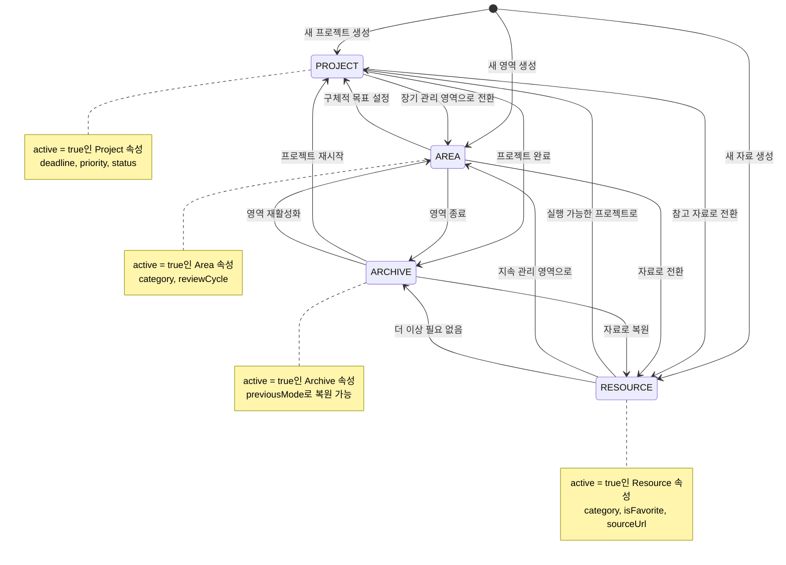
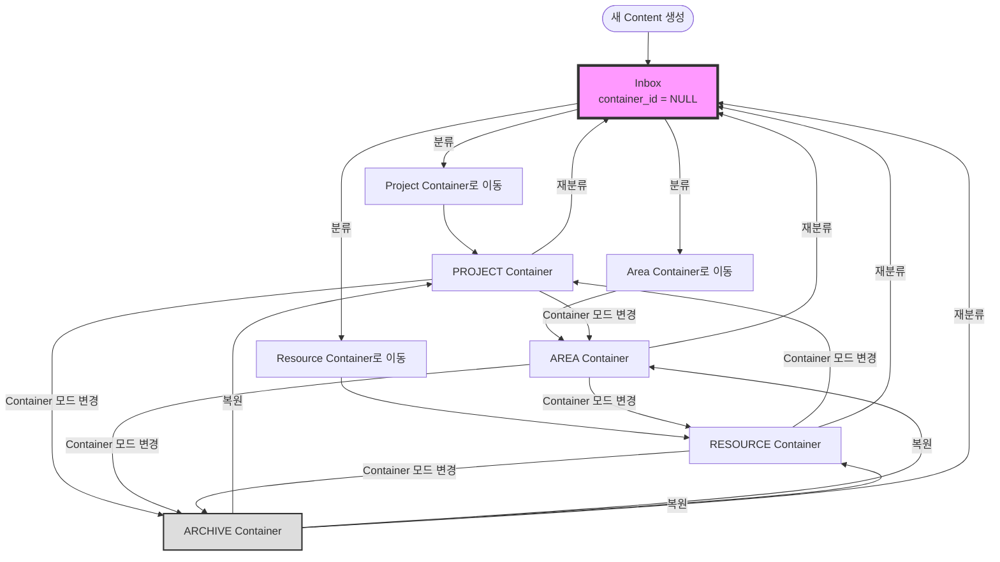

# PARA Note API - Architecture Documentation

## 1. Entity Relationship Diagram (ERD)

## 2. Container Transformation Sequence Diagram

### 2.1 Project → Area → Project (데이터 보존)

### 2.2 Project → Archive → Project (복원 시나리오)

## 3. Domain Model Class Diagram

## 4. Container Transformation State Machine

## 5. Content Flow Diagram

## 6. 핵심 설계 원칙

### 6.1 Container Transformation Model
- **단일 Container**: 하나의 Container가 여러 모드 간 전환
- **속성 보존**: 모드 변경 시 이전 속성은 `active=false`로 비활성화되지만 삭제되지 않음
- **완벽한 복원**: 이전 모드로 돌아갈 때 모든 데이터 그대로 복원
- **히스토리 추적**: 모든 모드별 속성이 영구 보존되어 변경 이력 확인 가능

### 6.2 Content Independence
- **Container 독립성**: Content는 Container와 독립적으로 존재
- **자유로운 이동**: Container 간 자유롭게 이동 가능 (`moveTo`)
- **Inbox 패턴**: `container_id = NULL`인 Content는 미분류 상태 (Inbox)
- **Container 모드 무관**: Container의 모드 변경이 Content에 영향 없음

### 6.3 User-Defined Flexibility
- **유연한 카테고리**: category, priority, status 등 모두 사용자 정의 가능
- **Enum 제약 없음**: DB 레벨에서 CHECK constraint 없음
- **확장 가능**: 새로운 모드나 속성 추가 용이

### 6.4 PARA Philosophy
- **Projects**: 명확한 목표와 기한이 있는 작업
- **Areas**: 지속적인 관리가 필요한 책임 영역
- **Resources**: 관심 주제의 참고 자료
- **Archives**: 비활성화되었지만 보존된 정보

## 7. 주요 사용 시나리오

### 7.1 새 프로젝트 시작
1. Container 생성 (`currentMode = PROJECT`)
2. Project 속성 설정 (deadline, priority, status)
3. Content 생성 및 Container 연결

### 7.2 프로젝트 → 영역 전환
1. Container의 `currentMode`를 AREA로 변경
2. Project 속성 `active = false` (데이터 보존!)
3. Area 속성 생성 (`active = true`)
4. Content는 그대로 유지 (container_id 변경 없음)

### 7.3 프로젝트 완료 → 아카이브
1. Project `status = "완료"` 업데이트
2. Container의 `currentMode`를 ARCHIVE로 변경
3. Archive 속성 생성 (`previousMode = "PROJECT"`)
4. 나중에 `previousMode`를 참고하여 복원 가능

### 7.4 Inbox에서 분류
1. Content 생성 시 `container_id = NULL` (Inbox)
2. 적절한 Container로 이동 (`moveTo(containerId)`)
3. Container의 모드에 따라 자동 분류
